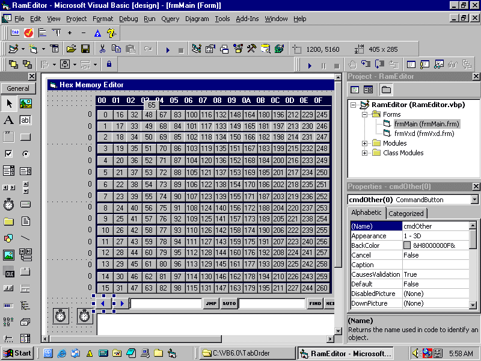



## Tab Order

### Description

Tab Order ia a Visual Basic Add-In that allows you to reorder each Control(s) Tab Order or Tab Indexes to your specifications. Several methods allow you to do this quickly and efficiently.

By order of the controls Left position on the form.

By order of the controls Top position on the form.

By order of selection of controls.

By order of individual incrementing tab index or decrementing tab index.

This is a true add-in meaning it is run in the IDE.

To run and setup see the Help file.
 
### More Info
 
See Help file.

             |
---                |---
**Submitted On**   |2005-04-02 06:04:52
**By**             |[Mark Duhame](https://github.com/Planet-Source-Code/PSCIndex/blob/master/ByAuthor/mark-duhame.md)
**Level**          |Advanced
**User Rating**    |4.6 (23 globes from 5 users)
**Compatibility**  |VB 6\.0
**Category**       |[Miscellaneous](https://github.com/Planet-Source-Code/PSCIndex/blob/master/ByCategory/miscellaneous__1-1.md)
**World**          |[Visual Basic](https://github.com/Planet-Source-Code/PSCIndex/blob/master/ByWorld/visual-basic.md)
**Archive File**   |[Tab\_Order187094422005\.zip](https://github.com/Planet-Source-Code/mark-duhame-tab-order__1-59802/archive/master.zip)

